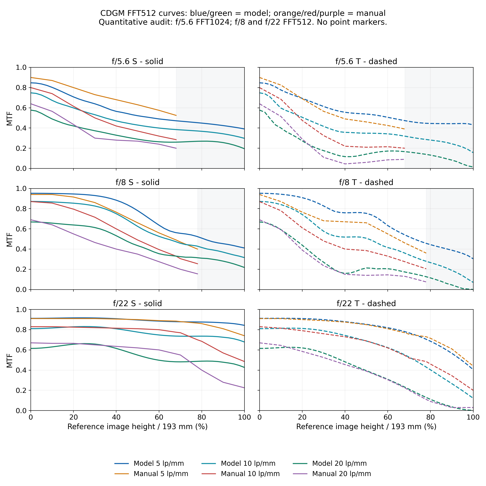
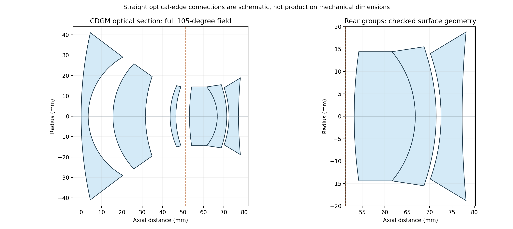
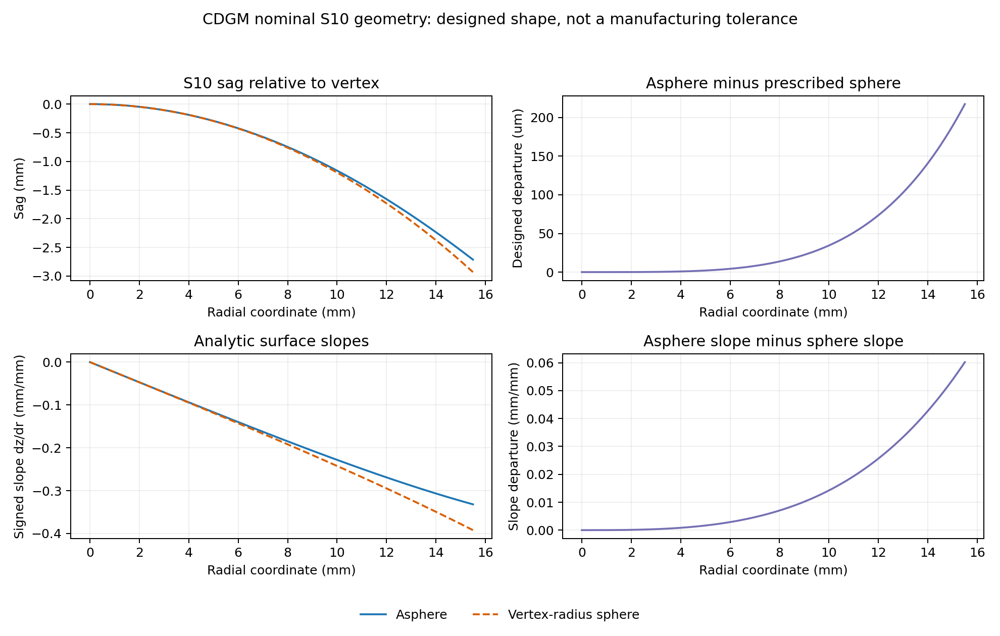

# Super-Symmar XL 150 mm f/5.6 光学性能与制造可能性报告 - CDGM

## 方案与材料身份

全 CDGM 材料优化方案。本报告仅引用本方案冻结 best 的原生复算，不将其等同于旧 R4 材料或处方。材料替换并不自动带来性能提高或实测降本。

| 片 / 前面 | 历史参考玻璃 | 本方案原生材料 | 原生目录候选 |
| --- | --- | --- | --- |
| L1 / S1 | KF9 | H-KF6 | CDGM |
| L2 / S3 | N-LAK33B | H-LAK53A | CDGM |
| L3 / S5 | N-LAK33B | H-LAK53B | CDGM |
| L4 / S8 | N-SK5 | H-ZK3A | CDGM |
| L5 / S9 | F2 | F4GTI | CDGM |
| L6 / S11 | K10 | H-K1 | CDGM |

## 材料供应与报价边界

此表只核验 native 名称、目录归属及历史材料替换关系。目录存在不代表毛坯可买；没有供应商正式报价、相同批量规格、熔次与工艺询价，不报告确定的价格节省比例、成本或交期。全 CDGM 仅表示处方材料来源约束，不证明配方等同原厂。

## 结论与判定边界

本次审核仍有离散对照点低于重新量读的原厂 MTF，尚未满足全点达到或超过的目标。 受检光学表面区域未发现交叠。 本轮将非球面最高阶限制为 A6，只含 A4、A6，不允许 A8 及更高项。下表为本轮原生 FFT 结果；本轮 A6 Huygens 独立抽查未完成或记录尚不满足同模型同设置要求。 不使用 R3 高阶候选的 Huygens 结果代替。原厂扫描图人工读数的不确定度约为 2-4 个百分点；严格达到读数、在读图误差带内相容，以及连续全视场都优于原厂，是不同的判断。本报告不将后两者替代严格离散点判定，也不承诺量产性能。

| 光圈 | 最大低于原厂
百分点 | 严格达到下限
样点数 | 不足不超过 4 点
样点数 |
| --- | --- | --- | --- |
| f/5.6 | 11.52 | 27 / 48 | 30 / 48 |
| f/8 | 2.18 | 57 / 60 | 60 / 60 |
| f/22 | 10.21 | 45 / 78 | 66 / 78 |

## 手册数据来源

本轮采用 target_optimization.json 中的手册目标，来源为 R3 已独立审核的密集人工数字化读数，不能当作原厂原始数值表。橙、红、紫色线为手册读数折线，蓝、青、绿色线为本轮 A6 模拟结果。未公开参考线的视场不推定原厂 MTF 为零，旧目标不同条件下的结果不直接用于本轮优劣判定。

## 审核数据说明

手册数据对应用户提供的 PDF 第 2 页无限远物距一行，保留原始扫描图和旧读数用于追溯。f/8 的 78% 终点应包含在本轮验收中；实际是否直接复算由 acceptance.json 的直接/插值点数量判定。

## 模型与共同模拟条件

无限远物距、平面像面；全部光圈均保留 105.0° 全视场，最大半视场 52.5000°。采用原厂 546、644、588、480、436、405 nm，权重 24.6、18.6、22.1、12.4、15.2、7.1%。MTF 比较采用 5、10、20 lp/mm；列次序为 T、S，S 实线、T 虚线。光阑半口径解算：Automatic。

## 统一像面

本报告不为不同光圈分别移动像面。末面到像面名义距离为 135.18108473 mm。三文件同像面已由验证数据明确记录。 三档记录：f/5.6: 135.18108473 mm；f/8: 135.18108473 mm；f/22: 135.18108473 mm。原厂聚焦程序的完全等效性仍须由实际验证流程确认，不能仅凭焦距与像距接近推断。

## 采样收敛与误差

图中完整视场曲线均采用原生 FFT512；定量验收 f/5.6 为 FFT1024，f/8 与 f/22 为 FFT512。收敛表比较同一处方、同一聚焦条件下的最终高采样与 256 采样。该差异检查数值稳定性，不代表制造公差、原厂读图精度或实物 MTF。完整曲线必须与 validated.json 的冻结 source_sha256 一致，附加审核文件身份缺失或不一致时不引用其数值。

## 模拟 MTF 与手册 MTF 对比

## 图线与视场说明

每行分别为 f/5.6、f/8、f/22，每列分别为 S、T 方向。共享图例放在六个绘图区外的下方，列出模拟与手册的三种频率，全部曲线不使用点标记。横坐标以手册最大像高 193 mm 归一化，灰色区仅表示没有公开参考曲线，不改变模型最大视场。折线之间的细节不能视为原厂公开的连续数值。

| 光圈 | 高采样 | 相对 256 最大变化
百分点 | 最大不足的位置 |
| --- | --- | --- | --- |
| f/5.6 | 1024 | 0.090 | 40.0% / 5 lp/mm S |
| f/8 | 512 | 0.088 | 0.0% / 20 lp/mm T |
| f/22 | 512 | 0.111 | 60.0% / 20 lp/mm S |

## 结构与几何可行性

## 手册结构图的作用

手册右上结构图与专利第一实施例轴上顶点共同定标的比例约 6.351 像素/mm，轴向残差 RMS 约 0.052 mm。此结果支持该图作为光学布局与有效口径的参考，但人工读图不是实物计量，也不是生产尺寸公差。口径读图不确定度约 ±0.3 mm。

| 空气间隙 | 检查半径 mm | 最小间隙 mm |
| --- | --- | --- |
| S2 - S3 | 25.800 | 10.14700 |
| S4 - S5 | 15.000 | 12.07173 |
| S6 - S8 | 14.400 | 5.26811 |
| S10 - S11 | 15.800 | 0.83796 |

## 最后两片的保守检查

对 S10 非球面与 S11 末片前球面，保守将球面延伸至 S10 的通光半径再增加 0.3 mm 读图余量，检查结果最小空气间隙为 0.83796 mm。全部受检空气间隙最小值为 0.83796 mm。另检查六片玻璃在共同有效口径内的局部厚度。以上是名义光学面几何检查，未包含压圈、倒角、胶层、装配偏心与温度误差；不能当作装配间隙的公差保证。结构图中的直线边缘连接仅为示意。

## 单位与面号

长度单位为 mm，曲率半径正负采用 Zemax 顺序追迹约定。厚度表示到下一面沿轴距离；S12 的厚度为末面到统一像面距离。玻璃名称表示该面之后介质，空白为空气；S7 为独立光阑面。本表包含全部 12 面，不包含无限远物面与像面。

| 面 | 曲率半径 mm | 到下一面 mm | 玻璃 | 通光半径 mm |
| --- | --- | --- | --- | --- |
| 1 | 187.804380 | 3.465446 | H-KF6 | 41.0000 |
| 2 | 33.245160 | 12.150997 | 空气 | 29.0000 |
| 3 | 37.530055 | 15.986301 | H-LAK53A | 25.8000 |
| 4 | 60.403342 | 12.071729 | 空气 | 19.5000 |
| 5 | 36.696195 | 2.832310 | H-LAK53B | 15.0000 |
| 6 | 43.617642 | 4.793313 | 空气 | 14.5000 |
| 7 光阑 | 平面 | 1.891933 | 空气 | 14.1926 |
| 8 | 101.326866 | 13.633527 | H-ZK3A | 14.4000 |
| 9 | -22.565711 | 4.653828 | F4GTI | 14.4000 |
| 10 | -42.452930 | 1.089626 | 空气 | 15.5000 |
| 11 | -42.252820 | 4.705125 | H-K1 | 14.0000 |
| 12 | 202.619473 | 135.181085 | 空气 | 18.8000 |

## S10 最高 A6 偶次非球面

z(r)=c*r^2/[1+sqrt(1-(1+k)*c^2*r^2)]+A4*r^4+A6*r^6，其中 c=1/R。本轮仅有 A4、A6，A8 及更高项必须为零。脚本发现非零高阶项会停止生成报告。系数采用 mm 单位，必须与曲率半径共同使用，不能解释为面形误差公差。光阑行是 f/5.6 时的自动半口径，其它光圈由原生模型自动解算。

| 参数 | CDGM 最终数值 | 单位 |
| --- | --- | --- |
| 圆锥常数 k | 0.0 | 无量纲 |
| A4 | 3.213328789792e-06 | mm^(-3) |
| A6 | 2.303664239694e-09 | mm^(-5) |

## 结构变化按最终数据统计

以下变化由最终 CDGM 与 R2 的 validated.json 逐面比较得出，不假设本轮实际使用了哪组优化变量或限制。未列出的对应数值在 1e-8 mm 比较阈值内一致。S12 间隔变化表示共同像面的变化，不是镜片中心厚度。

| 面号 | CDGM - R2 |
| --- | --- |
| S1 | R -13.272726 mm；间隔 +0.065446 mm；玻璃 KF9 -> H-KF6 |
| S2 | R -0.130597 mm；间隔 -0.849003 mm |
| S3 | R +0.256039 mm；间隔 -0.043699 mm；玻璃 N-LAK33B -> H-LAK53A |
| S4 | R +0.093576 mm；间隔 +0.435729 mm |
| S5 | R +0.098211 mm；间隔 -0.367690 mm；玻璃 N-LAK33B -> H-LAK53B |
| S6 | R -0.091033 mm；间隔 -0.046588 mm |
| S7 | 间隔 +0.671834 mm；口径半径 -0.085065 mm |
| S8 | R +2.311691 mm；间隔 +0.533527 mm；玻璃 N-SK5 -> H-ZK3A |
| S9 | R +1.248075 mm；间隔 -0.046172 mm；玻璃 F2 -> F4GTI |
| S10 | R -0.248397 mm；间隔 +0.099626 mm |
| S11 | R -1.774706 mm；间隔 -0.594875 mm；玻璃 K10 -> H-K1 |
| S12 | R -0.966130 mm；间隔 -0.220457 mm |

## 非球面与一阶参数变化

A4、A6 系数相对 R2 对应项的差值依次为：+4.165142e-07；-1.721920e-08。R2/R3 的非零高阶项属于历史候选，本轮没有沿用它们。本轮有效焦距为 148.167246 mm，入瞳位置为 36.710885 mm，首面到末面的轴向长度为 77.274135 mm。原厂公开对应值约为 148.1、36.6、77.4 mm；参数接近不代表完整处方已被唯一恢复。

## 材料采购与加工

处方中玻璃是完整色散目录候选，其名称和在 Zemax 中存在不等于已确认现货或毛坯可用。应取得供应商实际熔次色散、均匀性、退火、尺寸和环境稳定性数据；更换玻璃需在全波段重新优化。胶合组外非球面需要加工、定心与独立面形检测方案，明确有效口径、基准球、边缘余厚、胶层及倒角后才可询价。

## 年代工艺背景与 A6 限制

本轮按原镜头年代的制造约束审视非球面，减少高阶自由度至 A4、A6。但多项式阶数低不自动证明当年或今天可制造：同样的 A6 曲面仍可能有较大的设计离开量、斜率变化或边缘加工负担。是否适合相应年代的工艺，需要有效口径、PV、最大斜率、检测基准、材料毛坯、胶合与定心方案，以及制造商或实物证据共同判断。此处不凭系数阶数推定历史工艺、加工精度或良率。

## 厂家主源与证据边界

施耐德 Aspheric technology 技术文献明确列出 XL ASPHERIC 150/5.6，并说明小区域数控成形/抛光、CGH 辅助干涉检测和反馈修正抛光路线。此证据强于按年代猜测设备能力。但公开 PDF 未标日期，不能据此断言 1996 年某批实物使用同一设备和规范。文献中的约 1.5 mm 离开量、全局小于 1 μm 等说明值未明确对应本镜头，不作为当前处方公差、能力上限或生产保证。

## 专利、低阶限制与制造预审

US5870234A 的德国优先权为 1996-09-06，公开日为 1999-02-09；它没有公开原厂非球面系数或多项式阶数，附图为示意。A4/A6 限制来自本轮用户要求，不是专利恢复出的事实。年代预审将数控非球面加工与干涉检测反馈列为候选工艺路线，仍需核实当时小口径玻璃加工、CGH 和设备可达精度；不据此断定当年实物使用同一方案。当前候选的精度、成本及良率需工艺、公差和样机验证。k 的贡献必须与 A4/A6 一并记录。

制造主源：[施耐德 Aspheric technology](https://schneiderkreuznach.com/application/files/3515/0781/8891/aspheric-technology.pdf)，[US5870234A](https://patents.google.com/patent/US5870234A/en)。

## 制造可能性的当前结论

本次审核仍有离散对照点低于重新量读的原厂 MTF，尚未满足全点达到或超过的目标。 受检光学表面区域未发现交叠。 即使理想 MTF 达到原厂，也只是名义设计结果。本轮没有曲率、厚度、间距、偏心、倾斜、非球面误差、胶层、装配补偿和温度的完整公差分析，没有 Monte Carlo 良率或样机实测。因此可以继续设计评估，不能据此声明直接量产、生产良率、成本或交期。

## 非球面离开量与斜率

S10 有效半径 15.500 mm；参考为处方指定顶点半径球面，不是拟合最佳球面。设计离开量范围 0.000 至 217.419 μm，PV 217.419 μm；最大绝对表面斜率 0.331955 mm/mm，最大绝对斜率离开量 0.060230 mm/mm；最大绝对表面倾角 18.3638°。这些是设计面形及斜率，不能称为要求工厂达到的误差公差。

| 镜片 / 玻璃 | 中心厚度 mm | 共同口径边缘厚度 mm | 受检最薄处 mm |
| --- | --- | --- | --- |
| L1 / H-KF6 | 3.46545 | 18.20258 | 3.46545 |
| L2 / H-LAK53A | 15.98630 | 13.75684 | 13.75684 |
| L3 / H-LAK53B | 2.83231 | 2.32676 | 2.32676 |
| L4 / H-ZK3A | 13.63353 | 7.41324 | 7.41324 |
| L5 / F4GTI | 4.65383 | 7.48754 | 4.65383 |
| L6 / H-K1 | 4.70512 | 7.57615 | 4.70512 |

## 厚度检查范围

采用 20001 个均匀径向样点，曲面导数按储存的圆锥加偶次多项式解析计算。镜片厚度只覆盖前后光学面的共同有效口径，未定义的倒角和机械外缘不在检查域内。制造指标中的保守后组间隙为 0.83796 mm；这也不是带公差的装配最小间隙。

## 审核文件与方法

原生审核模型：SuperSymmarXL_150_CDGM_f5p6.zmx。审核的末面像距 135.18108473 mm；入瞳单位圆每波长 1257 个均匀笛卡尔网格射线，6 个波长。主光线使用原生真实光线并与 REAY 交叉检查。审核不保存或改写交付 ZMX。

| 光圈 | 公开对照场最大映射偏差 mm | 公开对照场最大相对畸变 % | 轴上 / 全场边缘几何瞳份额 % |
| --- | --- | --- | --- |
| f/5.6 | 1.44254 | 1.0992 | 100.00 / 14.36 |
| f/8 | 1.55509 | 1.0992 | 100.00 / 29.79 |
| f/22 | 1.55509 | 1.0992 | 100.00 / 94.42 |

## 像高映射的判定

表中偏差为实际主波长主光线像面 y 与 193h mm 的差，相对畸变为该差除以 193h。已有审核证明映射偏差的数值，尚不自动证明 MTF 已按相同实际像高重采样或重新优化；有明显偏差时，严格与手册比较应按真实像高重新指定视场。主光线的错误码、遮挡码及多波长记录保留在审核 JSON 中。

## 瞳面与照度的区别

几何瞳份额是单位圆网格中错误码和遮挡码均为零的射线比例，按六波长权重汇总；它不等于照度、透射率或生产良率。边缘值覆盖完整系统视场，可能超出某光圈的手册 MTF 公开范围。MTF 归一化后可与很低的通光份额同时存在，因此不能仅凭 MTF 提升推断通光性能提高。

| 光圈 | 原生相对照度审核 |
| --- | --- |
| f/5.6 | 首列相对照度：轴上 1.000000，扫描终点 0.018440；范围 0.018440 至 1.000000 |
| f/8 | 首列相对照度：轴上 1.000000，扫描终点 0.040376；范围 0.040376 至 1.000000 |
| f/22 | 首列相对照度：轴上 1.000000，扫描终点 0.125762；范围 0.125762 至 1.000000 |

## 原生照度数据列

原生照度结果 Y 数据第一列为相对照度，第二列为工作 f 数。本表仅引用第一列，未把工作 f 数混入照度统计；端点是原生扫描的最后一个样点，具体扫描坐标保留在审核 JSON。几何瞳份额与该照度结果保持独立。

## 原厂聚焦规则的扫描检查

按 f/5.6、轴上 20 lp/mm、256 采样扫描统一像面。正式像面平均 T/S MTF 为 0.577548；扫描最佳样点位于正式像面 +0.000000 mm，MTF 0.577548，增益 0.0000 个百分点。最佳点位于扫描内部；这是有限网格局部扫描，不能直接证明全局最佳聚焦。 正式像面与扫描最佳样点重合，满足本次有限网格局部扫描的原厂轴上最大化检查。

## 采用同一手册读数的 R2 对照

R2 按本轮 186 项手册目标、原厂六波长、固定通光口径和 f/5.6 轴上 20 lp/mm 最大化规则重新聚焦复算；三档光圈使用共同像面。下表比较最大不足，数值越小越好；R2 使用 256 采样，本轮使用前文最终高采样，因此不将末位小差异解释为确定的设计增益。最大不足定义为 max(手册 MTF - 模拟 MTF, 0)。

| 光圈 | 同条件 R2 最大不足
百分点 | 本轮最大不足
百分点 |
| --- | --- | --- |
| f/5.6 | 18.065 | 11.524 |
| f/8 | 8.403 | 2.180 |
| f/22 | 13.781 | 10.213 |

## 改善的限度

最大不足降低只表明该光圈的最差下限差距缩小，不能推导每一条曲线、每一个视场都比 R2 或原厂更好。前文逐点有符号差和最终共同像面记录仍是本次判定依据。

## A6 候选独立抽查未完成

两份本轮 A6 spot 文件尚未齐全。 本报告不沿用 R3 Huygens 曲线或数值作为 A6 证明。FFT 高采样收敛也不能自动证明宽角度出瞳假设完全成立。

方向定义：[施耐德 MTF 说明](https://schneiderkreuznach.com/en/industrial-optics/knowledge-hub/modulation-transfer-function)。计算假设：[Ansys FFT MTF 文档](https://ansyshelp.ansys.com/public/Views/Secured/Zemax/v252/en/OpticStudio_User_Guide/OpticStudio_Help/topics/FFT_MTF.html)。

## 选定六片的同目录 OD

以下 OD 第一项取自冻结 CDGM AGF 的同目录相对成本，六片未加权求和只用于该目录内部筛选，不是毛坯或成镜价格。历史混合材料只列对应关系，不以其 SCHOTT OD 比较节省比例。

| 片 / 前面 | 历史混合材料 | 选定 CDGM | OD 相对成本 |
| --- | --- | --- | --- |
| L1 / S1 | KF9 | H-KF6 | 3.6000 |
| L2 / S3 | N-LAK33B | H-LAK53A | 11.6000 |
| L3 / S5 | N-LAK33B | H-LAK53B | 5.5000 |
| L4 / S8 | N-SK5 | H-ZK3A | 1.0000 |
| L5 / S9 | F2 | F4GTI | 45.9000 |
| L6 / S11 | K10 | H-K1 | 12.6000 |

## 所选目录代理

六片 OD 未加权合计 80.2000；目录标题 CC Updated Jun 2022。原始 OD 行、manifest/目录 snapshot hash 和 catalog_plan hash 保存在 catalog_tradeoff_audit.json。无供应商正式人民币报价、尺寸/熔次/数量/工艺询价，不报告实测降本或跨目录节省百分比。

| 候选与六片组合 | CDGM OD 和 | 筛选最大不足 / 点 | 筛选采样 | 最终高采样复核 |
| --- | --- | --- | --- | --- |
| 正式选定 / 最低光学筛选分数 / 筛选 Pareto
H-KF6 / H-LAK53A / H-LAK53B / H-ZK3A / F4GTI / H-K1 | 80.2000 | 11.544 | 256 | 已完成：本方案 |
| 最低目录代理筛选可行 / 筛选 Pareto
H-K51 / H-LAK53B / H-LAK53B / H-ZK3A / H-F4 / H-K10 | 18.8000 | 68.569 | 256 | 未独立复核 |
| 筛选 Pareto
H-K51 / H-LAK53B / H-LAK53B / H-ZK3A / F4GTI / H-K1 | 72.1000 | 54.918 | 256 | 未独立复核 |
| 筛选 Pareto
H-KF6 / H-LAK53B / H-LAK53B / H-ZK3A / F4GTI / H-K1 | 74.1000 | 12.101 | 256 | 未独立复核 |

## 性能与成本候选边界

本次可核对 7 个全 CDGM 优化筛选组合；其中 6 个目录 OD 合计低于正式选定组合。最低代理为 18.8000，其筛选最大 MTF 不足为 68.569 个百分点，非本方案的独立高采样结果。 光学筛选分数为最大短缺+0.2×短缺RMS；它不是毛坯成本或量产目标。Pareto 仅针对本次已搜索、同目录代理和筛选光学分数，范围有限。正式选定方案的高采样结果由主验收表提供，不能把其它组合的筛选值混入其中。

## 筛选可行不等于生产可行

表中未独立复核的组合仅为优化筛选值，其“可行”指当时几何与一阶参数门槛。它不表示高采样已验证、MTF 全面达到手册、供应可买或制造放行。全球筛选分数最佳可能不是 OD 最低；选择目录代理较低的组合前必须冻结该候选并重新完成同条件高采样、像高/聚焦、几何、公差与样机验证。

## 衍射参考的含义

采用原厂六波长权重计算无像差、无遮拦圆形瞳孔的非相干衍射 MTF，归一化空间频率为波长(mm) × f数 × lp/mm。这是指定圆瞳形状的轴上参考，不是适用于任意离轴截瞳、渐晕或瞳面加权系统的通用严格上限，不能把本模型离轴 MTF 高于某项圆瞳值直接认定为计算错误。

| 光圈 | 5 lp/mm | 10 lp/mm | 20 lp/mm |
| --- | --- | --- | --- |
| f/5.6 | 0.980799 | 0.961604 | 0.923244 |
| f/8 | 0.972572 | 0.945157 | 0.890423 |
| f/22 | 0.924613 | 0.849508 | 0.701290 |

## 性能余量与制造

尤其在 f/22，原厂轴上曲线已经接近该圆瞳衍射参考，进一步提高理想设计的可用余量较小。制造公差会消耗名义性能余量；本轮不从衍射参考推导任何加工公差、良率或最终实物性能。

## 验证范围

本报告对最终输入数据进行独立几何和 MTF 下限统计，不自行重跑光学优化。acceptance.json 保存每光圈的最大短缺、严格达标数量、2/4 点读图带数量、直接复算与插值点数、共同像面记录，以及逐点有符号差。geometry_verified.json 保存受检口径与名义间隙。仅有离散点达标时，不将结果扩展为整个连续场域必然优于手册。

## 严格比较尚需区分的事项

Angle 视场、真实像高、原厂聚焦和归一化 MTF 是不同的条件。审核记录存在时，本报告引用其实际结果；条件未完成时明确保留缺口，不因离散曲线改善而声称所有光学性能均优于原厂。即使一个局部聚焦扫描最佳，也需同像面验证其它光圈并复查高采样收敛。

## 完成目标仍需的工作

应继续修正最大不足所在视场的处方，并同时检查其它光圈和方向，避免通过牺牲某些曲线获得局部改进。 随后冻结共同聚焦程序、机械有效口径、完整遮挡与装配结构；开展有补偿的公差分析、透射与照度、畸变和有限倍率验证；最后通过样机测量确认性能和生产可行性。

## 复算数据与文件

overnight_20260915/cdgm/validated.json：本轮最高 A6 候选的最终高采样离散 MTF、处方与一阶数据。overnight_20260915/cdgm/field_curves.json：本轮完整视场模拟曲线。overnight_20260915/cdgm/target_optimization.json：本轮正式手册目标。revision2/validated.json：历史处方结构对照；revision2/drawing_constraints.json：结构图定标记录。revision3 中的高阶候选与 Huygens 初审仅属于历史资料，不代表本轮 A6 处方已复核。全部产出保存在 SuperSymmarXL 文件夹中。

## 原始资料

用户提供的 super-symmar_xl_56_150.pdf：公开性能、光谱权重、视场及结构示意。用户提供的 US5870234 Super Symmar XL patent.pdf：结构与专利实施例参考。公开数据不足以唯一恢复原厂实际处方、非球面、制造尺寸及公差；本报告的 ZMX 是可复算的逆向候选，不是经过原厂认证的生产处方。
